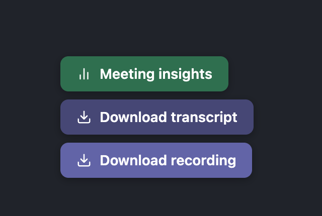
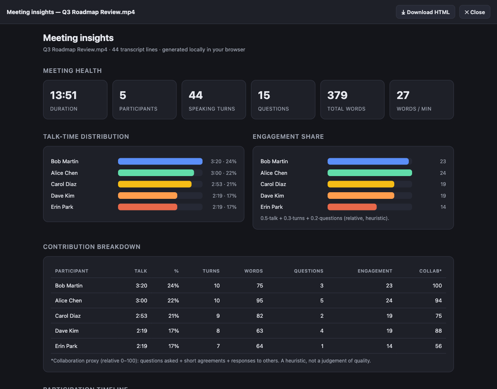
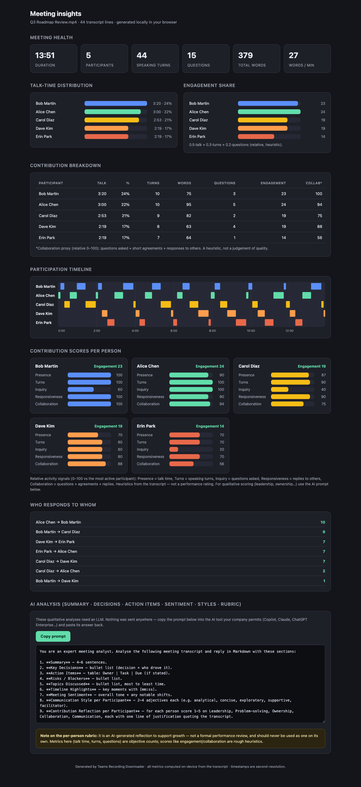

# Teams Recording Downloader

A Chrome (Manifest V3) extension that downloads **Microsoft Teams / SharePoint
Stream** meeting recordings and transcripts, and generates a **local meeting-insights
dashboard** — entirely in the browser.

## Screenshots

Floating action buttons (bottom-right on any recording):

Meeting-insights dashboard, opened in-page (Download HTML / Close in the top bar):

The full dashboard — talk-time, engagement, per-person contribution scorecards,
a participation timeline with a time axis, speaker interactions, and an
exportable AI prompt:

> Screenshots use synthetic sample data.

## Features

- **Download recording** — grabs the DASH manifest + `x-spopactoken` from the
  OnePlayer, downloads the segments, decrypts the DASH-SEA AES-128-CBC
  "clear-key" encryption via Web Crypto, and muxes audio+video into a flat MP4.
  (Hard-DRM recordings — Widevine/PlayReady/FairPlay — cannot be decrypted and
  are detected and reported.)
- **Download transcript** — scrapes the rendered transcript panel (auto-scrolls
  the virtualized list, dedupes by `aria-posinset`) and saves a `.vtt` subtitle.
- **Meeting insights** — an in-page dashboard computed locally from the
  transcript: talk-time distribution, engagement/collaboration proxies,
  participation timeline, topic frequency, speaker interactions, plus a
  copy-paste LLM prompt for the qualitative analyses.

All three actions run independently and can be cancelled mid-run.

## Privacy

Everything is computed **in your browser**. The extension makes no third-party
network calls — it only talks to the same SharePoint/`svc.ms` hosts the player
already uses. The qualitative (LLM) analyses are **not** sent anywhere; they are
packaged as a prompt you copy into whatever AI tool you are permitted to use.

## Install (unpacked)

1. `chrome://extensions` → enable **Developer mode**.
2. **Load unpacked** → select this folder.
3. Open a Teams/SharePoint recording; the floating buttons appear bottom-right.
   (For transcript/insights, open the **Transcript** panel first.)

## Use responsibly

Only download recordings you are authorized to access, and follow your
organization's policies. The per-person insights are heuristics / AI reflections,
**not** a formal performance evaluation.

## Development

No build step — plain JS. CI runs `node --check` on every script and validates
`manifest.json`.

## ⭐ Star this repo

If it saved you time, drop a star — it helps others find it and tells me to keep improving it.

### Star history

